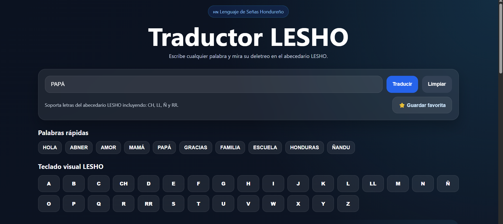
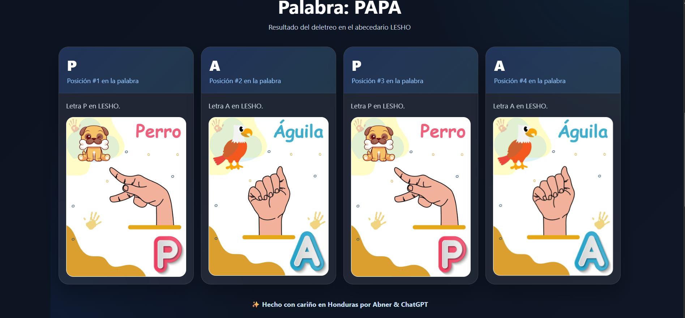
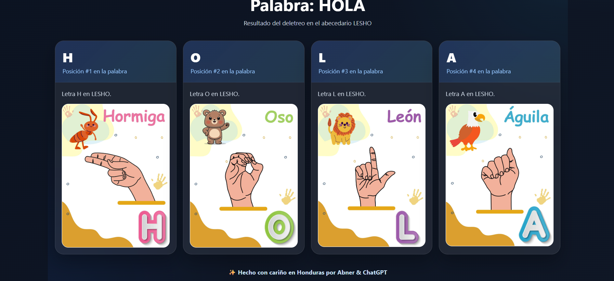
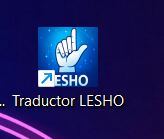

# 🇭🇳 Traductor LESHO – Lenguaje de Señas Hondureño

Aplicación educativa gratuita desarrollada para apoyar el aprendizaje del **Lenguaje de Señas Hondureño (LESHO)** mediante el deletreo visual de palabras usando el abecedario de señas.

---

## ✨ Características

* 🔎 Traducción de palabras a deletreo visual LESHO
* 🔠 Soporte para letras especiales:
  - **CH**
  - **LL**
  - **Ñ**
  - **RR**
* ⚡ Palabras rápidas para aprendizaje más ágil
* ⭐ Sistema de favoritos
* 🕘 Historial de búsquedas
* 🖼️ Vista ampliada de señas
* 📥 Descarga del resultado como imagen
* 📱 Aplicación instalable como **PWA**
* 🌐 Disponible online desde navegador y móvil

---

## 🎯 Propósito del proyecto

Este proyecto fue creado con fines **educativos y de accesibilidad**, con el objetivo de facilitar el aprendizaje visual del abecedario del **Lenguaje de Señas Hondureño** y ofrecer una herramienta sencilla, gratuita y útil para estudiantes, docentes y cualquier persona interesada en aprender.

---

## 🚀 Demo online

### 🌐 GitHub Pages
👉 **[Abrir Traductor LESHO](https://demodexgames.github.io/lesho-app/)**

### 🎮 itch.io
👉 **[Ver en itch.io](https://demodexgames.itch.io/lesho-app)**

---

## 📱 Instalación en dispositivos

### Android
1. Abre la app desde el navegador
2. Presiona el botón de **Instalar app** (si aparece)
3. O usa el menú del navegador → **Agregar a pantalla de inicio**

### iPhone / iPad
1. Abre la app en **Safari**
2. Presiona **Compartir**
3. Selecciona **Agregar a pantalla de inicio**

---

## 🧠 Cómo usar

1. Escribe una palabra en el campo principal
2. Presiona **Traducir**
3. Explora cada seña del resultado
4. Haz clic en una imagen para verla ampliada
5. Guarda palabras favoritas
6. Descarga el resultado como imagen si lo deseas

---

## 🛠️ Tecnologías utilizadas

* **HTML5**
* **CSS3**
* **JavaScript (Vanilla JS)**
* **PWA (Progressive Web App)**
* **GitHub Pages**
* **itch.io (HTML5)**

---

## 📂 Estructura del proyecto

```bash
lesho-app/
│
├── index.html
├── style.css
├── app.js
├── data.json
├── manifest.json
├── service-worker.js
├── .nojekyll
└── images/
    ├── ... imágenes de señas
    ├── icon-192.png
    └── icon-512.png
```

---

## 📸 Capturas del proyecto

### 🏠 Pantalla principal


### 🔎 Resultado de traducción


### 🖼️ Vista ampliada de seña


### 📱 Aplicación instalada (PWA)

---

## 💙 Créditos

**Proyecto desarrollado por:**

* **Abner Maldonado**
* **ChatGPT**

✨ Hecho con cariño en Honduras.

---

## 📌 Estado del proyecto

**Versión actual:** `v1.0`

Proyecto funcional, publicado online y disponible como aplicación instalable.

---

## 📜 Licencia / uso

Este proyecto se comparte con fines educativos y demostrativos.  
Si deseas reutilizarlo o adaptarlo, se recomienda mantener los créditos correspondientes.

---
